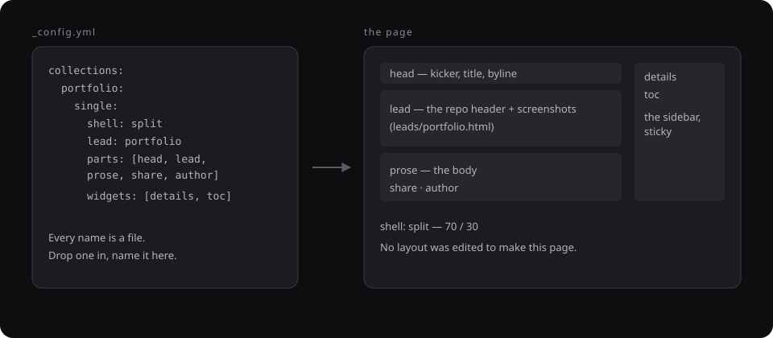
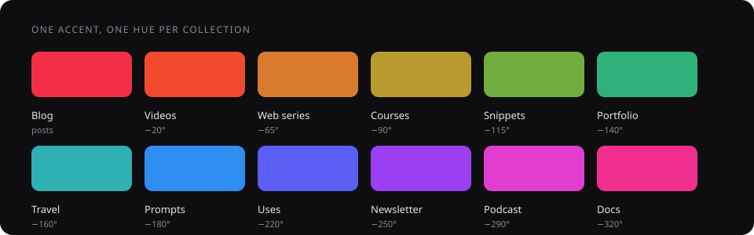

<div align="center">


# Scratchpad

**A dev portfolio theme. One design, every stack.**
Thirteen content collections, a resume that stands on its own, a tag index,
four ways to look at every listing, and a setup form that writes the config
for you — on Jekyll today, on the stack you already use next.

[Live demo](https://scratchpad.imswarnil.com) · [Docs](https://scratchpad.imswarnil.com/docs/) · [Style guide](https://scratchpad.imswarnil.com/styleguide/) · [Roadmap](ROADMAP.md)

</div>

---

## Start one in a minute

```bash
npx scratchpad-theme my-site
```

It clones the theme, drops the history so the first commit is yours, clears
the demo content, and opens the setup form. Then:

```bash
cd my-site
npm run dev        # http://localhost:4000
```

Push to a repo named `username.github.io`, set **Settings → Pages → Source:
GitHub Actions**, and you are live. The workflow passes GitHub's own base
path to Jekyll, so the same setup is correct for a user page and a project
page — you never set `baseurl` by hand.

---

## What a page is made of

This is the idea the whole theme hangs on. **An entry page is a list in
`_config.yml`, not a template**: which parts to stack, which widgets sit
beside them, which lead block goes under the title, and how wide the page is.



Every name is a file. `parts` are `_includes/single/<name>.html`, `widgets`
are `_includes/widgets/<name>.html`, `lead` is `_includes/leads/<name>.html`.
**To invent a part, drop a file in and name it.** No layout is edited, and any
single entry can override all four in its own front matter.

### Five shells

| `shell` | What it is | Used by |
| --- | --- | --- |
| `reading` | A reading column, centred, nothing beside it | posts, snippets, prompts, newsletter |
| `aside` | A reading column with a rail beside it | podcast |
| `wide` | The full fluid container | videos, web series, episodes, courses |
| `split` | 70 / 30, the rail sticky | portfolio, travel, uses |
| `course` | Contents on the **left**, the page beside them | lessons, the docs |

---

## Thirteen collections, one colour each

Every collection's hue is the site accent with its hue rotated, so changing
`accent_color` moves all of them together. The chips, the cover art, the
kickers and the card rules all read the same variable.



| Folder | What it is | Card |
| --- | --- | --- |
| `_posts/` | Essays and notes | editorial |
| `_portfolio/` | Projects, films, design | repo card |
| `_videos/` | Films — 9:16 entries become reels | player |
| `_webseries/` + `_episodes/` | A series and its episodes | portrait poster |
| `_courses/` + `_lessons/` | A course and its curriculum | course card |
| `_podcast/` | Audio episodes | episode with a player |
| `_newsletter/` | Issues, in full | issue row |
| `_snippets/` | Copy-pasteable code | code window |
| `_prompts/` | Prompts, **and what they produced** | chat window |
| `_travel/` | Trips | photo card |
| `_uses/` | Hardware, software, gear | product card |
| `_docs/` | The manual | doc row |

Delete any you do not want — the setup form retires the folder, the landing
page and the config entry together, and backs them up first.

---

## Four ways to look at a listing

| View | What it does |
| --- | --- |
| **card** | The newest entry leads across the top, the rest in a grid |
| **grid** | Every card the same |
| **list** | One column, the picture beside the words |
| **simple** | One column, a title and a date — an index, not a feed |

The cards never change markup; the feed decides their shape, and a reader's
choice is remembered across the site. Cards in a row are always the same
height, whatever they carry.

---

## What else is in the box

- **A resume** that drops the site chrome entirely, opens on its own hero, and
  collapses into an island bar as you scroll. Prints to a clean PDF.
- **A tag page per tag**, across every collection — not just posts.
- **Ask an AI** on every entry: opens Claude, ChatGPT or Perplexity with the
  page's URL and a prompt to read it and answer you.
- **Comments** via giscus, utterances or Disqus, with an honest placeholder
  until you pick one.
- **Search** — a command palette on `/` and a full page.
- **Generated cover art** for anything without a picture: the collection's
  colour, pattern and mark, drawn as SVG. No title inside the picture.
- **Dark mode**, with no flash, and a toggle in the header.
- **A setup form**, a doctor that catches the mistakes that break a build, and
  a test suite for both.

---

## The commands

| Command | What it does |
| --- | --- |
| `npm run setup` | The browser setup form |
| `npm run dev` | Local server with live reload |
| `npm run build` | Production build into `_site/` |
| `npm run new` | Scaffold an entry in any collection |
| `npm run thumbs` | Redraw the cover art from your accent colour |
| `npm run doctor` | Check the config for the mistakes that break a build |
| `npm run test` | The config and wizard test suite |
| `npm run check` | Doctor + build — what CI runs |

Ruby 3.4 and Node 18+. The macOS system Ruby (2.6) cannot build this site;
`bin/serve` and `bin/build` put the right toolchain on your PATH.

---

## House style

The CSS follows the [Im Design System](https://design.imswarnil.com), and it
has exactly two interactions:

- **Hover** — the thing *fills*. Nothing sharpens a border, nothing grows
  three per cent, nothing rests on a drop shadow.
- **Current** ("you are here") — a stronger fill and a bolder label. Never a
  change of colour.

The accent belongs to the primary button, a link's hover, the focus ring, text
selection and each collection's hue. Nothing else.

---

## Docs

- **[/docs/](https://scratchpad.imswarnil.com/docs/)** — setting it up, deploying,
  writing a post, adding a collection, composing a page, cards and views,
  styling.
- **[/styleguide/](https://scratchpad.imswarnil.com/styleguide/)** — every card,
  component and colour on one page, drawn from the real content.
- **`.claude/skills/personal-site/SKILL.md`** — the same ground, written for
  an AI assistant. If you use one, point it there.

## Licence

MIT. The demo content and the brand marks are the author's; the code is yours
to use.
